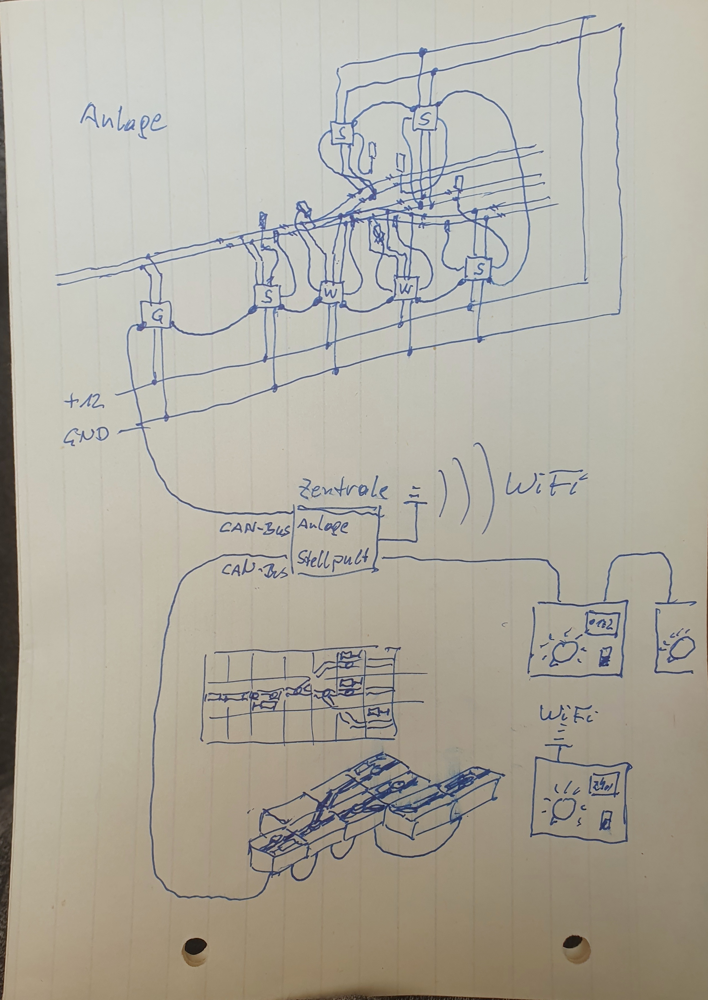

# Railway-CAN
*Das Projekt ist in der Phase des Brainstormings.*

Ziel des Projekts ist es, eine analog betriebene Modelleisenbahn so auszurüsten, dass ein weitgehend vorbildlicher Betrieb erreicht wird. Weichen, Signale und Fahrstraßen bedient das Stellwerk, eine Lokomotive wird von einem Lokführer gesteuert, er sieht seine Signale und kann darauf reagieren.

Das System besteht aus den Anlagenmodulen, dem Stellpult, den Fahrpulten und der Zentrale.

Es handelt sich dann um eine digitale Modellbahn, bei der jedoch die Anlage digitalisiert wird und nicht die Fahrzeuge. Jede analoge (und auch digitaler) Lok kann darauf ohne Eingriff in das Fahrzeug eingesetzt werden.

Die befahrenen Gleisabschnitte werden automatisch vom System geschalten. Es können so viele Loks gleichzeitig fahren, wie es freie Gleisabschnitte gibt. Für jede Lok muss dann auch ein Fahrregler und Lokführer vorhanden sein.

Um nicht von propräitärer Software abhängig zu sein, soll die gesamte Steuerung mit den Hardware-Bausteinen und der Software von Railway-CAN abgedeckt sein. Ich greife dabei auf die Erfahrungen aus dem [Loco-CAN](https://github.com/loco-can) Projekt zurück, dass eine ähnliche Hardware verwendet.

Der Aufbau und die Verkabelung der Anlage, sowie die nötigen Einstellunge sollen für jeden Modellbahner auch ohne Programmierkenntnisse umsetzbar sein und gleichzeitig der Verkabelungsaufwand reduziert werden. Dies wird durch den Einsatz eines CAN-Busses erreicht.

Da das gesamte Projekt, Hard- wie Software, open source sind, können auch in Zukunft jederzeit Module für Erweiterungen nachgefertigt werden. 

## Anlage
Je nach existierender Verkabelung der Modellbahn können die Anlagemodule direkt auf der Anlage verlegt werden oder beim bisherigen Stellpult. Wichtig ist, dass Kabel die Schienen, die Weichen oder Signalen mit den Modulen verbinden müssen. Bei einer Neuverkabelung ist es ratsam die Module unter der Anlage anzubringen. Alle Module werden an eine Versorgung-Ringleitung angeschlossen, die von einem Netzteil für die gesamte Anlage gespeist wird. Es ist auch möglich bei großen Anlagen mehrere Netzteile für Anlagenteile zu verwenden, es muss dann nur der Minuspol aller Netzteile verbunden sein.

## Stellwerk
[Stellwerk](docs/signal_box.md)

Das Stellwerk ist ein physisch aufgebautes Spurplanstellwerk der Type Siemens SP Dr S60. Es beinhaltet alle Bedienelemente und Ausleuchtungen zum Stellen der Weichen, Signale, Schranken und Fahrstraßen.

Die Blöcke werden aus 3D-gedruckten Teilen zusammengesetzt. Im Inneren sitzt die Elektronik für den jeweiligen Block mit Tasten, LEDs oder einem Display für die Zugnummer.

Die Verkabelung der einzelnen Blöcke im Atelier untereinander ist ganz einfach, werden sie lediglich mit einem vierpoligen Kabel beliebig miteinander verbunden. Die letzte Verbindung läuft zur Zentrale.

Die Zuordnung zwischen den Anlagenmodulen und den Stellwerksblöcken muss nur einmalig erfolgen und ist ganz einfach gehalten.

Für eine große Anlage können auch mehrere kleine Stellwerke aufgebaut werden, die dann zusammenarbeiten.

## Anlagenmodule
[Abschnitts-Steuerung](docs/section_controller.md)

Auf der Anlage werden die isolierten Gleisabschnitte, die Signal, Weichen und Schrankenanlagen mit jeweils dem passenden Anlagenmodul verbunden. Für die verschiedenen Aufgaben gibt es unterschiedliche Module.

Jedes Anlagenmodul besitzt einen Anschluss für die DC-Versorgungsspannung und zwei Busstecker. Die Fahrspannung wird in jedem Modul gesteuert und darf 2 Ampere in dem Bereich nicht überschreiten. Bei einem Kurzschluss in einem Abschnitt schaltet nur dieses Modul ab, die restliche Anlage bleibt weiter in Betrieb.

Der CAN-Bus wird einfach von einem Modul zum nächsten mit zweipoligen Kabeln verbunden. Es können mindestens 100 Module an einem Bus betrieben werden, die Zentrale bietet mehrere Busse an. Die maximale Länge einer Busleitung sollte 100 Meter nicht überschreiten.

Je nach Modul gibt es noch die nötigen Anschlüsse zur Anlage (Gleis, Signal, Weichenantrieb, Gleisüberwachung).

### Gleismodul
Das Gleismodul ist für ein durchgehendes Gleis zwischen zwei Signalen gedacht. Es wird mit zwei Kabeln an den Gleisabschnitt angeschlossen. Jeder Abschnitt muss beidpolig von den benachbarten Gleisen isoliert sein. 

Signale, Kreuzungen und Weichen benötigen einen eigenen Abschnitt. Eisenbahnkreuzungen werden nur durch einen Freimelder überwacht.

### Signalmodul
Das Signalnodule wird mit zwei Kabeln an den Gleisabschnitt im Bereich des Signals angeschlossen. Zusätzlich gibt es Anschlüsse für die Ansteuerung eines Licht- oder Formsignals.

Für die Überwachung des Signals wird ein Gleisfreimelder verwendet.

### Weichenmodul
[Weichen](docs/switch.md)

### Eisenbahnkreuzungsmodul
Das Modul für Eisenbahnkreuzungen ist mit dem Signalmodul ident, die jeweilige Funktion wird über einen Schalter am Modul gewählt. 

Die Blinklichtanlage wird mit den Anschlüssen für das Signal verbunden. Es ist kein eigener Gleisabschnitt nötig.

## Gleisfreimeldung
[Freimeldesensor](docs/sensor.md)

Für einen vorbildlichen Betrieb ist es wichtig zu wissen, welcher Abschnitt von Fahrzeugen besetzt ist. Um nicht nur Lokomotiven und deren Stromverbrauch zu erkennen, sondern den gesamten Zug, werden Time of Flight-Sensoren (ToF) eingesetzt, die einen bestimmten Raum mittels Laserstrahl überwachen. Es wird so die Anwesenheit jeglichen Fahrzeuges erkannt, ohne jede Waggonachse mit einem Widerstand versehen zu müssen. Ein geschobenen Zug bleibt korrekt vor dem Signal stehen oder löst zum richtigen Zeitpunkt eine Zwangsbremsung beim Überfahrenen Signal aus.

Die Feimeldung wird über die ToF-Sensoren, der Strommessung am Gleis und dem Status der Gleis- und Signalnodule bestimmt.

## Zentrale
[Zentrale](docs/central.md)

Die Zentrale verdient den Namen eigentlich nicht, da sie keine zentrale Steuerung vereint, sondern lediglich die Kommunikation aller Komponenten untereinander ermöglicht. 

Sie besitzt einen USB-Anschluss zum Anschluss an einen PC. Ein Computer ist für den normalen Betrieb NICHT nötig. Es können jedoch alle Schalt- und Fahrbefehle von einem Computerprogramm gesendet werden, um so z.B. ein Fahrplan vorgeben zu können. Die Zugfahrten können in dem Fall manuell erfolgen oder auch automatisch.

Eine Software dafür ist derzeit nicht Teil des Projekts. Das Protokoll zur Steuerung wird jedoch hier offengelegt.

## Fahrpult
Jedes Fahrpult kann mir einer Lok verbunden werden, indem sie Loknummer eingegeben wird. Das Gleis, auf dem die Lok steht, erhält die gleiche Nummer und wird mit diesen Fahrpult gesteuert.

Es können mehrere Fahrpulte angeschlossen werden. Die Fahrpulte bieten einen Fahrregler, einen Schalter für die Fahrtrichtung und ein Display, auf dem die nächsten Signale angezeigt werden. Über einen Drehregler lässt sich die Loknummer einstellen.
